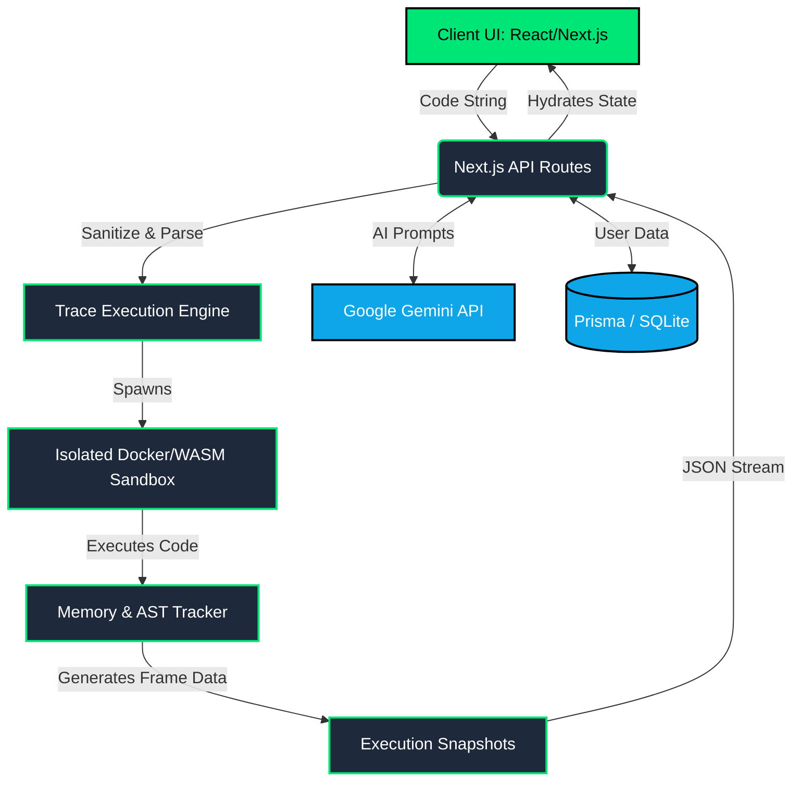

<div align="center">

<!-- Animated Header SVG -->


<br/>

<!-- Primary Tech Badges -->
<a href="https://nextjs.org/"></a>
<a href="https://www.typescriptlang.org/"></a>
<a href="https://tailwindcss.com/"></a>
<a href="https://www.framer.com/motion/"></a>

<br/><br/>

<!-- Stats & Repo Badges -->
<a href="https://github.com/Satya522/CodeTrace/stargazers"></a>
<a href="https://github.com/Satya522/CodeTrace/network/members"></a>
<a href="https://github.com/Satya522/CodeTrace/issues"></a>
<a href="https://github.com/Satya522/CodeTrace/blob/master/LICENSE"></a>
<a href="https://codetrace.dev"></a>

<br/><br/>

> **CodeTrace** is a next-generation, interactive code visualization engine designed to demystify complex algorithms and memory management. We believe that seeing is understanding. Watch your code execute in real-time, inspect live memory heaps, trace call stacks, and get AI-powered explanations for every single instruction.

[**🚀 Live Demo**](https://codetrace.dev) &nbsp; • &nbsp; [**📖 Documentation**](https://codetrace.dev/docs) &nbsp; • &nbsp; [**💬 Discord Community**](https://codetrace.dev/discord) &nbsp; • &nbsp; [**🐛 Report a Bug**](https://github.com/Satya522/CodeTrace/issues)

</div>

<br/>

---

## 📑 Table of Contents

<details>
<summary><b>Click to expand</b></summary>
<br/>

1. [The Philosophy: Why CodeTrace?](#-the-philosophy-why-codetrace)
2. [Core Features Showcase](#-core-features-showcase)
3. [Architecture & System Design](#-architecture--system-design)
4. [The 52-Section Premium Library](#-the-52-section-premium-library)
5. [Quick Start & Installation](#-quick-start--installation)
6. [Usage & Configuration](#-usage--configuration)
7. [API Reference](#-api-reference)
8. [Roadmap 2026](#-roadmap-2026)
9. [Contributing Guide](#-contributing-guide)
10. [FAQ](#-faq)
11. [License & Acknowledgements](#-license--acknowledgements)

</details>

---

## 💡 The Philosophy: Why CodeTrace?

Learning Data Structures, Algorithms, and System Design traditionally relies on static textbooks, whiteboards, or simple `print()` statements. **CodeTrace flips the paradigm.**

Instead of *guessing* what happens to your variables inside a recursive loop, CodeTrace hooks into the actual execution thread, parses the Abstract Syntax Tree (AST), and renders a real-time, 60FPS visualization of your computer's memory. It bridges the gap between abstract code and physical execution.

---

## ✨ Core Features Showcase

We didn't just build a compiler; we built a cinematic experience for your code.

<table>
  <tr>
    <td width="50%" valign="top">
      <h3>🎯 Step-by-Step Time Travel</h3>
      <p>Control the flow of time. Pause, rewind, fast-forward, or step through your code frame-by-frame. Never miss a variable mutation again.</p>
    </td>
    <td width="50%" valign="top">
      <h3>🧠 Deep Memory Inspection</h3>
      <p>Watch as the <b>Call Stack</b> pushes and pops frames. See the <b>Heap</b> allocate objects, draw reference pointers, and visualize garbage collection.</p>
    </td>
  </tr>
  <tr>
    <td width="50%" valign="top">
      <h3>🤖 Gemini-Powered AI Tutor</h3>
      <p>Stuck on a line of code? Our integrated Google Gemini AI analyzes the exact execution context and explains the logic in plain English.</p>
    </td>
    <td width="50%" valign="top">
      <h3>🏎️ Algorithm Race Mode (New!)</h3>
      <p>Curious why QuickSort beats BubbleSort? Put them side-by-side and watch them race across a visual array in real-time.</p>
    </td>
  </tr>
  <tr>
    <td width="50%" valign="top">
      <h3>🎨 Pro-Grade Code Editor</h3>
      <p>Powered by <b>Monaco Editor</b> (the engine behind VS Code). Enjoy rich IntelliSense, syntax highlighting, and minimap support right in the browser.</p>
    </td>
    <td width="50%" valign="top">
      <h3>🌐 Multi-Language Core</h3>
      <p>Seamlessly switch between <b>Python, JavaScript, TypeScript, Java, C++,</b> and even <b>SQL</b>. The engine normalizes execution across runtimes.</p>
    </td>
  </tr>
</table>

---

## 🏗️ Architecture & System Design

CodeTrace uses a decoupled, high-performance architecture ensuring that heavy code compilation never blocks the main UI thread.



### Tech Stack Breakdown

- **Frontend:** Next.js 14 App Router, React 18, TailwindCSS 3.4, Framer Motion 13
- **Editor:** Monaco Editor (react-monaco-editor)
- **Visuals:** HTML5 Canvas, React Flow, Custom SVG animations
- **Backend/API:** Next.js Serverless Functions, Google Gemini SDK
- **Database:** Prisma ORM, SQLite (Ready for PostgreSQL scale-up)

---

## 📚 The 52-Section Premium Library

CodeTrace isn't just a tool; it's a complete encyclopedia for computer science. Our built-in markdown library covers 10 major disciplines broken down into 52 exhaustive sections.

| Discipline | Covered Topics |
|------------|---------------|
| 🟢 **Data Structures** | Arrays, Linked Lists (Singly/Doubly), Stacks, Queues, Hash Tables, Trees (BST, AVL, Red-Black), Graphs (Directed, Undirected, Weighted), Heaps, Tries. |
| 🔴 **Algorithms** | Sorting (Merge, Quick, Heap, Radix), Searching (Binary, DFS, BFS), Dynamic Programming (Memoization, Tabulation), Greedy Algorithms, Backtracking. |
| 🔵 **Relational DBs (SQL)** | MySQL, PostgreSQL architecture, Joins, Window Functions, CTEs, Indexing Strategies, Query Execution Plans (EXPLAIN), Normalization. |
| 🟡 **NoSQL & Caching** | MongoDB (Aggregation pipeline, Sharding), Redis (Pub/Sub, Data Types, Cache Invalidation Strategies). |
| 🟣 **Languages Deep Dive**| **Python** (Generators, Decorators, GIL), **JavaScript** (Event Loop, Closures, Prototypes), **C++** (Pointers, Memory Leaks, STL), **Java** (JVM, Garbage Collection, Multithreading), **TypeScript** (Generics, Utility Types). |

---

## 🚀 Quick Start & Installation

You are 3 steps away from running the engine locally.

### 1. Prerequisites
- **Node.js** (v18.17.0 or newer)
- **npm** (v9.x or newer)
- Git

### 2. Setup the Environment

```bash
# Clone the repo
git clone https://github.com/Satya522/CodeTrace.git

# Move into the project
cd CodeTrace

# Install dependencies (We recommend npm for native module compatibility)
npm install
```

### 3. Configure Environment Variables

```bash
# Create your local env file
cp .env.example .env
```
*Open `.env` and configure your API keys (e.g., `GEMINI_API_KEY` for AI features).*

### 4. Launch the Engine

```bash
# Start the Next.js Turbopack dev server
npm run dev
```

Visit **[http://localhost:3000](http://localhost:3000)**. The dark, glassmorphism UI awaits you.

---

## ⚙️ Usage & Configuration

### Toggling Device Modes
CodeTrace features a responsive workspace. Click the **Laptop/Tablet icon** in the Navbar to instantly reflow the UI:
- **Laptop Mode:** Horizontal split (Editor on left, Visualizer on right). Best for ultrawide screens.
- **Tablet Mode:** Vertical split (Editor on top, Visualizer on bottom). Best for narrow screens or heavy reading.

### Speed Control
Use the playback bar below the visualizer to adjust execution speed:
- `0.25x` - Slow-motion (Best for tracing recursion)
- `1.0x` - Normal speed
- `2.0x` - Fast-forward (Best for skipping initialization loops)

---

## 🗺️ Roadmap 2026

We are constantly pushing the boundaries of what browser-based execution can do.

- [x] **Phase 1:** Core engine, Monaco integration, Dark UI.
- [x] **Phase 2:** Memory stack/heap visualizer, 52-section library.
- [x] **Phase 3:** Gemini AI integration, Playback controls.
- [ ] **Phase 4 (Upcoming):** Multiplayer collaboration (Pair-trace in real-time).
- [ ] **Phase 5:** 3D WebGL Visualization (Rotate and fly through your data structures).
- [ ] **Phase 6:** VS Code Extension (Bring CodeTrace natively into your IDE).

---

## 🤝 Contributing Guide

We welcome contributions from the community! Whether it's a new algorithm animation, a bug fix, or a typo correction in our library.

1. **Fork** the repository on GitHub.
2. **Clone** your fork locally.
3. **Branch** out: `git checkout -b feat/your-awesome-feature`.
4. **Commit** using Conventional Commits: `git commit -m "feat: added Dijkstra algorithm visualization"`.
5. **Push** to your fork and open a **Pull Request**.

See our full [CONTRIBUTING.md](CONTRIBUTING.md) for code style, testing requirements, and architecture guidelines.

---

## ❓ FAQ

**Q: Is my code sent to a server?**  
A: Standard code execution happens entirely in your browser using WebAssembly. Only if you click "Explain with AI", the code snippet is sent to the Gemini API.

**Q: Can I embed CodeTrace in my blog?**  
A: Yes! We are working on an iframe-friendly embed route (`/embed?code=...`) releasing in the next minor update.

**Q: Why Next.js instead of Vite?**  
A: Next.js provides us with Server Components for rendering the massive 52-section markdown library instantaneously without bloating the client-side JavaScript bundle.

---

<div align="center">


<br/>

**Designed & Engineered by [Satya](https://github.com/Satya522)**

*Open source, free forever.*

<a href="https://github.com/Satya522/CodeTrace/stargazers">
  
</a>

</div>
