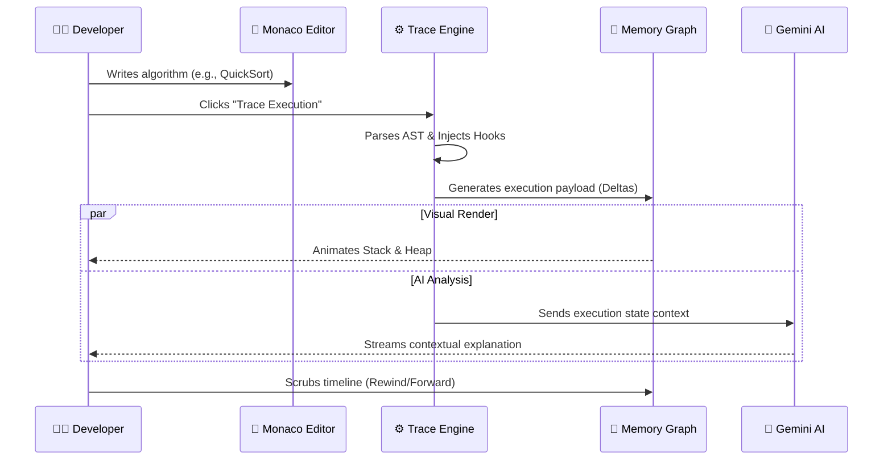

<div align="center">

<br/>
<br/>


<br/>
<br/>

<h1 align="center">
  <b>CodeTrace</b>
</h1>

<p align="center">
  <a href="https://codetrace.dev">
    
  </a>
</p>

<p align="center">
  A next-generation interactive execution visualizer, memory tracker, and AI-tutor.<br/>
  Built for developers who demand to see what happens under the hood.
</p>

<br/>

<div align="center">
  <a href="https://nextjs.org"></a>
  <a href="https://www.typescriptlang.org/"></a>
  <a href="https://tailwindcss.com/"></a>
  <a href="https://github.com/Satya522/CodeTrace/blob/master/LICENSE"></a>
</div>

<br/>
<br/>

</div>

---

<br/>

> *"Most developers write code. The top 1% understand how it executes. CodeTrace bridges that gap by turning abstract memory management into a high-fidelity cinematic experience."*

<br/>

## ✦ The Vision

CodeTrace is not just another IDE or code runner. It is an **Execution Visualization Engine**. We parse your code into an Abstract Syntax Tree (AST), hook into the runtime environment, and stream the exact state of the Call Stack, Heap Memory, and execution pointers directly to a 60FPS hardware-accelerated frontend canvas.

Whether you are debugging a complex Recursive Backtracking algorithm, traversing a Red-Black Tree, or understanding exactly how the V8 Event Loop closures work — CodeTrace makes the invisible, visible.

<br/>

---

## ✦ Core Engine & Architecture

<br/>


### 1. Deterministic Execution Sandbox
At the heart of CodeTrace lies a custom execution environment. By compiling execution traces into JSON delta payloads, we ensure that every memory mutation, variable assignment, and pointer shift is strictly deterministic. You can scrub through your code's execution timeline just like a YouTube video — forwards, backwards, or frame-by-frame.

<br/>
<br/>


### 2. High-Fidelity Memory Visualizer
The UI doesn't just print variables; it draws them. 
* **The Call Stack:** Watch frames push and pop in real-time.
* **The Heap:** Complex objects (Trees, Graphs, Linked Lists) are algorithmically mapped out using forced-directed graphs and spatial positioning.
* **Reference Pointers:** Glowing SVG curves connect stack variables to their heap allocations.

<br/>
<br/>


### 3. Integrated AI Cognition
Powered by **Google Gemini**, the engine doesn't just show you *what* is happening, it tells you *why*. For every tick of the execution clock, the AI context-engine analyzes the AST node and generates human-readable micro-explanations. It’s like having a Staff Engineer sitting next to you, explaining why your loop just went infinite.

<br/>
<br/>

---

## ✦ The 52-Section Premium Library

CodeTrace ships with a massive, meticulously curated, 52-section interactive library. This isn't just text — every algorithm comes with live code that you can trace and modify instantly.

<details>
<summary><b>🟢 Data Structures & Algorithms (20 Sections)</b></summary>
<br/>

- **Foundations:** Arrays, Strings, Bit Manipulation, Math.
- **Linear Structures:** Linked Lists (Singly, Doubly, Circular), Stacks, Queues, Hash Tables.
- **Trees:** Binary Trees, BSTs, AVL Trees, Red-Black Trees, Tries.
- **Graphs:** Adjacency Matrices/Lists, Directed/Undirected, Weighted, MSTs (Kruskal/Prim).
- **Paradigms:** Two Pointers, Sliding Window, Greedy, Divide & Conquer.
- **Advanced:** Dynamic Programming (1D & 2D), Backtracking, Segment Trees.
</details>

<details>
<summary><b>🔵 Database Architecture (15 Sections)</b></summary>
<br/>

- **PostgreSQL:** ACID, Joins, Window Functions, CTEs, Indexing (B-Tree, GIN), EXPLAIN plans.
- **MySQL:** InnoDB Architecture, Locking Mechanisms, Sharding.
- **MongoDB:** BSON, Aggregation Pipelines, Replica Sets.
- **Redis:** In-Memory Caching, Pub/Sub, Eviction Policies (LRU/LFU).
</details>

<details>
<summary><b>🟡 Deep Language Internals (17 Sections)</b></summary>
<br/>

- **JavaScript/TypeScript:** Event Loop, Microtasks, Closures, Hoisting, V8 Engine Basics, Generics.
- **Python:** Global Interpreter Lock (GIL), Generators, Decorators, Dunder Methods.
- **C++:** Pointers, Memory Leaks, RAII, Smart Pointers, STL Deep Dive.
- **Java:** JVM Architecture, Garbage Collection (G1/ZGC), Multithreading.
</details>

<br/>

---

## ✦ System Flow Diagram

CodeTrace relies on a beautiful orchestration between the client layer and the execution engines.



<br/>

---

## ✦ Getting Started

Experience CodeTrace on your own machine. The local environment is optimized with Turbopack for sub-second HMR.

### Prerequisites
* Node.js v18.17.0+
* npm or pnpm

### Quick Installation

```bash
# 1. Clone the repository securely
git clone https://github.com/Satya522/CodeTrace.git

# 2. Navigate to the project directory
cd CodeTrace

# 3. Install all necessary dependencies
npm install

# 4. Bootstrap your environment variables
cp .env.example .env

# 5. Launch the Turbopack engine
npm run dev
```

Visit `http://localhost:3000` to access the workspace.

<br/>

---

## ✦ Project Structure

A clean, modular architecture makes CodeTrace easy to scale and contribute to.

```text
codetrace/
├── app/                    # Next.js 14 App Router
│   ├── algorithms/         # Interactive Markdown rendering engine
│   ├── api/                # Edge-ready API endpoints
│   └── docs/               # Technical documentation site
├── src/
│   ├── backend/            # Trace compilers, AST parsers, and AI handlers
│   ├── content/            # The 52-section algorithm markdown library
│   └── frontend/
│       ├── components/     # High-reusability React Server/Client Components
│       │   ├── Editor/     # Monaco implementations
│       │   ├── Visualizer/ # React Flow & Canvas rendering logic
│       │   └── UI/         # Glassmorphism design system (Tailwind)
│       └── views/          # Fully assembled page layouts
└── prisma/                 # Database schemas and edge-ready clients
```

<br/>

---

## ✦ Community & Contributing

We are building the future of computer science education, and we want you on board.

**How to contribute:**
1. Fork the repo & clone locally.
2. Branch out: `git checkout -b feature/your-feature-name`
3. Write clean, typed, and well-commented code.
4. Commit using conventional formats: `feat(engine): added AST support for structs`
5. Push & Open a PR.

*Check our [Contributing Guidelines](CONTRIBUTING.md) for deeper technical standards.*

<br/>

---

## ✦ License

Designed and open-sourced under the **[MIT License](LICENSE)**. You are free to use, modify, and distribute this software as long as you provide attribution.

<br/>

<div align="center">
  <p><b>Built with Absolute Precision & Passion by Satya</b></p>
  
  <a href="https://github.com/Satya522">
    
  </a>
</div>
