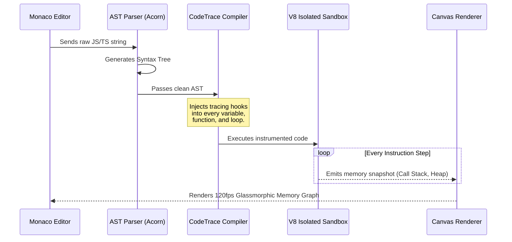

<div align="center">
  
  
  # The Official CodeTrace Handbook
  **A comprehensive, step-by-step masterclass on visual code execution.**
</div>

---

## 🌟 1. Introduction: The CodeTrace Philosophy

Welcome to the **CodeTrace Documentation**. Most developers learn to code by staring at static text or deciphering cryptic console logs. CodeTrace was built on a different philosophy: **Code is a living, breathing machine, and you should be able to watch its gears turn in real-time.**

Whether you are debugging a complex asynchronous data pipeline, untangling deeply nested recursive trees, or simply trying to understand how closures retain memory in JavaScript, CodeTrace renders the invisible state of your application as a cinematic, interactive graph.

---

## 🏗️ 2. Core Architecture (How it Works)

Understanding how CodeTrace executes your code will help you write better scripts. We use a highly sophisticated Abstract Syntax Tree (AST) instrumentation pipeline.



### 2.1 The AST Parsing Phase
When you press <kbd>Run</kbd>, your JavaScript is sent to an AST parser. The parser breaks your code down into a machine-readable tree, separating variable declarations, binary expressions, and function calls.

### 2.2 State Interception & Instrumentation
CodeTrace traverses the generated AST and injects tiny "tracer" functions before and after every operation. For example, a simple `let x = 5;` is internally rewritten to emit memory events, allowing our engine to capture every micro-change without relying on native browser debuggers.

### 2.3 The V8 Secure Sandbox
Your instrumented code is pushed to an ephemeral, isolated V8 execution context. 
- No access to the native DOM.
- No access to `fetch` or network requests.
- Strict limits on execution time.

---

## 👣 3. Step-by-Step Guide: Your First Visualization

Let's walk through your very first execution in CodeTrace.

### Step 1: Writing Code
1. Open the CodeTrace platform.
2. In the left-hand **Monaco Editor**, clear the default code.
3. Paste the following simple loop:
```javascript
let sum = 0;
for (let i = 1; i <= 5; i++) {
  sum += i;
}
console.log(sum);
```

### Step 2: Executing
1. Click the green **Run** button at the top right of the editor (or press <kbd>Ctrl</kbd> + <kbd>Enter</kbd>).
2. The engine will parse and compile your code in milliseconds.

### Step 3: Navigating the Timeline
1. Look at the **Control Deck** at the bottom of the screen.
2. You will see a scrubber (slider) representing the timeline of execution.
3. Click the **Step Forward (⏩)** button once. 
4. **Observe the Visualizer:** A block representing the Global Context appears. The variable `sum` will fade into existence with a value of `0`.
5. Keep clicking **Step Forward**. You will literally watch `i` increment and `sum` accumulate in real-time memory!

---

## 🖥️ 4. The Interface Deep Dive

Mastering the three primary zones will supercharge your workflow.

### 4.1 The Editor Panel
Powered by the **Monaco Editor**:
- Syntax highlighting and IntelliSense for JS/TS.
- Real-time syntax error validation.
- Auto-formatting and bracket matching.

### 4.2 The Visualizer Panel (The Canvas)
- **The Call Stack Column:** Shows active functions. When a function is called, a frame slides in. When it returns, it fades out.
- **The Heap Graph:** Objects and Arrays are interconnected nodes. Physical lines are drawn between them for reference sharing.
- **The Microtask Queue:** Visualizes pending Promises.

### 4.3 The Control Deck
- ⏮️ **Reset:** Clear memory.
- ⏪ **Step Back:** Rewind state by one instruction.
- ⏯️ **Play / Pause:** Auto-play the execution.
- ⏩ **Step Forward:** Advance exactly one instruction.

---

## 🧬 5. Step-by-Step: Visualizing Advanced Concepts

### 5.1 Understanding Pointers (Reference vs Value)
JavaScript handles objects by reference. Let's visualize this.
1. Type the following code:
```javascript
let a = [1, 2, 3];
let b = a;
b.push(4);
```
2. **Hit Run.** 
3. **What you will see:** CodeTrace will draw a single Array box in the Heap. Both the `a` and `b` variables in your stack will draw an arrow pointing to the **exact same box**. When `.push(4)` happens, you see it update for both!

### 5.2 Mastering Recursion (Fibonacci)
Recursion is notoriously hard to visualize. CodeTrace makes it trivial.
1. Type the following:
```javascript
function fib(n) {
  if (n <= 1) return n;
  return fib(n-1) + fib(n-2);
}
fib(3);
```
2. **Hit Run and use Auto-Play.**
3. **What you will see:** The Call Stack will spawn `fib(3)`, which spawns `fib(2)`, which spawns `fib(1)`. As base cases hit, the stack cards glow green (returning) and gracefully disappear, bubbling the return value up the chain.

---

## 🚨 6. Limits & Protections

To keep the platform stable, we enforce limits:

| Protection Type | Limit | Behavior on Breach |
| :--- | :--- | :--- |
| **Execution Steps** | 10,000 ops | Pauses and warns of potential infinite loop. |
| **Max Heap Size** | 2,000 nodes | Caps arrays at 500 visual elements. |
| **Time Limit** | 5000ms | Execution is hard-terminated. |

---

## ⌨️ 7. Keyboard Shortcuts

| Action | Windows / Linux | macOS |
| :--- | :--- | :--- |
| **Run Code** | <kbd>Ctrl</kbd> + <kbd>Enter</kbd> | <kbd>Cmd</kbd> + <kbd>Enter</kbd> |
| **Step Forward** | <kbd>F10</kbd> | <kbd>F10</kbd> |
| **Step Back** | <kbd>F9</kbd> | <kbd>F9</kbd> |
| **Play/Pause** | <kbd>F8</kbd> | <kbd>F8</kbd> |

---

## ❓ 8. Frequently Asked Questions (FAQ)

**Q: Why doesn't `document.getElementById` work?**
A: CodeTrace focuses purely on JavaScript logic, memory, and algorithms. The DOM is explicitly sandboxed out. Use `console.log` or watch the visualizer.

**Q: Can I visualize TypeScript?**
A: Yes! Our engine strips type annotations on the fly.

---

## 🤝 9. Support & Feedback

If you encounter a weird edge case:
- 💬 Join the discussion on our Discord.
- 🐛 Open an Issue on [GitHub](https://github.com/Satya522/CodeTrace).
- 📬 Contact me on the [Contact Page](/contact).

<br/>

<div align="center">
  <sub>End of Documentation. Now go build something amazing. © 2026 CodeTrace.</sub>
</div>
